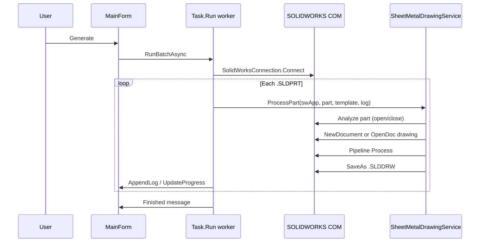

# Data flow

[← Documentation hub](../README.md) · [Architecture overview](overview.md)

## Batch run (UI → SOLIDWORKS)



---

## Single part: `ProcessPart`

**Class:** `SheetMetalDrawingService`  
**File:** `Services/SheetMetalDrawingService.cs`

| Step | Action | Output |
| --- | --- | --- |
| 1 | Validate part `.SLDPRT` and template `.DRWDOT` / `.SLDDRW` | — |
| 2 | `drawingPath = ChangeExtension(part, ".SLDDRW")` | Same folder as part |
| 3 | `PartModelAnalyzer.Analyze(swApp, partPath, log)` | `PartAnalysisResult` |
| 4a | Template `.DRWDOT` → `swApp.NewDocument(template)` | New drawing doc |
| 4b | Template `.SLDDRW` → copy to output path → `OpenDoc6` | Existing layout template |
| 5 | `ProcessDrawingModel(swApp, model, partPath, analysis, log)` | Annotated drawing |
| 6 | `SaveAs` or `Save3` (silent) | `.SLDDRW` on disk |
| 7 | `CloseDoc` | Drawing closed |

---

## Drawing processing: `ProcessDrawingModel`

1. Set drawing unit system to **MMGS** (millimetre–gram–second; internal lengths still meters in API).
2. `switch (analysis.Kind)` → call exactly one pipeline.
3. Pipeline returns; drawing remains open until save in step 6 above.

---

## Part analysis lifecycle

Analysis **always opens the part silently** and **closes it in `finally`**:

```
OpenDoc6(part, swDocPART, swOpenDocOptions_Silent)
  → walk feature tree + scan solid bodies
  → build PartAnalysisResult
  → CloseDoc(partPath)
```

The drawing pipeline later references the part by **file path** when creating views (`CreateDrawViewFromModelView3(partPath, …)`). The part file does not need to stay open during drawing creation.

---

## File path data

| Input | Source | Used for |
| --- | --- | --- |
| `partPath` | UI list box | Analysis, view creation, output folder |
| `templatePath` | UI text field | New drawing from `.DRWDOT` or copied `.SLDDRW` |
| `drawingPath` | Derived from part | Save target |

Default template (UI initial value): `AppMetadata.DefaultTemplatePath`.

---

## Logging data path

```
Pipeline / Service / Connection
  → Action<string> log callback
  → MainForm.AppendLog (marshalled to UI thread)
  → ThemedLogView.Inner (read-only TextBox)
```

SmartDim modules also write diagnostic lines to `Console.WriteLine` (visible when run from terminal, not in UI log today).

---

## Release notes data path

```
User clicks v0.0.01 in footer
  → ReleaseNotesForm
  → ReleaseNotesLoader.GetMarkdownForCurrentVersion()
       1. Disk: {ExeDir}/Docs/ReleaseNotes/v0.0.01.md
       2. Embedded resource: SolidWorksTester.Docs.ReleaseNotes.v0.0.01.md
       3. Fallback generated Markdown
  → MarkdownDocumentRenderer (Markdig)
  → MarkdownViewerControl (WebView2 NavigateToString)
```

See [In-app documentation viewer](../ui/documentation-viewer.md).

---

## See also

- [Part classification](../drawing/part-classification.md)
- [Pipelines overview](../drawing/pipelines-overview.md)
- [COM connection](../solidworks-api/com-connection.md)
