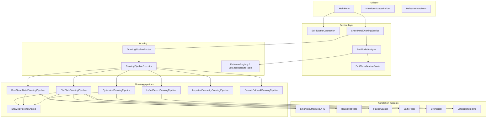

# Architecture overview

[← Documentation hub](../README.md)

## Purpose

**Sheet Metal Drawing Generator** is a Windows desktop utility that:

1. Connects to a local SOLIDWORKS instance via COM.
2. Classifies each `.SLDPRT` into a drawing pipeline (geometry + EST/custom properties).
3. Creates or updates a `.SLDDRW` next to the part using a user-selected template.
4. Inserts standard views and automated dimensions/annotations.

The application is **batch-oriented**: the UI collects parts and a template, then processes them sequentially on a background STA worker.

---

## Layered architecture



---

## Primary extension seam

```
PartModelKind / EST catalog
  → DrawingPipelineRouter (DrawingRouteDecision)
  → DrawingPipelineExecutor
  → *DrawingPipeline.Process(..., analysis, route, log)
  → SmartDim / specialised modules
```

| Layer | Stable contract | Typical change |
| --- | --- | --- |
| `PartModelKind` / EST registry | Enum + catalog id | New part family |
| `DrawingPipelineId` + Executor | Route decision | New top-level pipeline |
| `FlatPlateSubKind` + DimRouter | Nested flat families | Baffle / flange / disc |
| SmartDim / modules | `Add(..., log)` | New annotation type |

UI and COM connection code rarely need changes for new drawing logic.

---

## Key design decisions

| Decision | Rationale |
| --- | --- |
| **x64 process** | SOLIDWORKS is 64-bit; COM must match bitness |
| **Silent part open for analysis** | Faster batch; part closed immediately after classify |
| **Router + Executor** | Classification and dispatch stay testable without COM |
| **Pipeline per part type** | Orthographic + flat pattern vs isometric layouts differ |
| **Drawing-only annotations** | Model is read-only; no feature edits on the part |
| **Session `DimensionedFeatures` set** | Prevents duplicate dims within one drawing pass |
| **Post-pass deduper** | Removes value/text duplicates across views |
| **MMGS unit system on drawing** | Consistent meter-based API values internally |

---

## Threading model

| Thread | Work |
| --- | --- |
| UI (STA) | WinForms message loop, file dialogs |
| STA worker (`StaTaskRunner`) | SOLIDWORKS COM calls, batch loop |

All UI updates from the worker use `InvokeRequired` / `BeginInvoke` in `MainForm`.

**Important:** SOLIDWORKS COM calls must stay on the worker thread used for the batch.

---

## External dependencies

| Package | Role |
| --- | --- |
| `SolidWorks.Interop.sldworks` | Primary COM API |
| `SolidWorks.Interop.swconst` | Enumerations and constants |
| `Markdig` | Release notes Markdown → HTML |
| `Microsoft.Web.WebView2` | In-app documentation viewer |

---

## See also

- [Project structure](project-structure.md)
- [Data flow](data-flow.md)
- [Pipeline router](../drawing/pipeline-router.md)
- [COM connection](../solidworks-api/com-connection.md)
- [Pipelines overview](../drawing/pipelines-overview.md)
