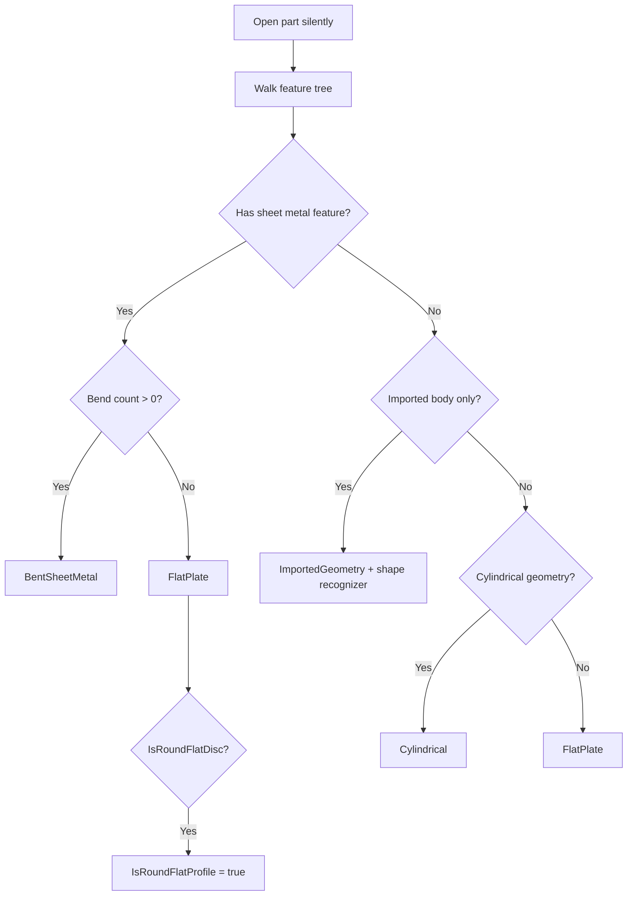

# Part classification

[← Documentation hub](../README.md) · [Data flow](../architecture/data-flow.md)

**Classes:** `PartModelAnalyzer`, `PartAnalysisResult`, `PartModelKind`  
**Location:** `Services/Analysis/`

---

## Output model: `PartAnalysisResult`

| Property | Type | Description |
| --- | --- | --- |
| `Kind` | `PartModelKind` | Pipeline selector |
| `BendFeatureCount` | `int` | Count of bend-type features |
| `HasSheetMetalFeature` | `bool` | Base flange / sheet metal / flat pattern in tree |
| `IsHollow` | `bool` | Tube/pipe (two distinct cylinder radii) |
| `HasHoles` | `bool` | Hole wizard features or small cylindrical faces |
| `HasChamfers` | `bool` | Chamfer/fillet features present |
| `CylindricalFaceCount` | `int` | Count of cylindrical faces on solids |
| `IsRoundFlatProfile` | `bool` | Disc-like flat plate (bbox heuristic) |
| `ActiveConfiguration` | `string` | Config name at analysis time |
| `IsImportedGeometry` | `bool` | Dumb solid from import (STEP/IGES/Interconnect) |
| `ImportedShape` | `ImportedGeometryShapeKind` | Recognized form for P-04 dimension strategy |
| `ImportFeatureCount` | `int` | Import features in FeatureManager tree |
| `ImportFeatureName` | `string` | Primary import node name (e.g. `Imported1`) |
| `BboxLongMeters` / `Mid` / `Short` | `double` | Sorted bounding-box axes (meters) |

---

## Classification decision tree

---

## Feature type sets

### Sheet metal root (`SheetMetalRootTypes`)

`SheetMetal`, `BaseFlange`, `FlatPattern`

### Bend features (`BendFeatureTypes`)

`EdgeFlange`, `Hem`, `Jog`, `SketchBend`, `SM3dBend`, `SMMiteredFlange`, `MiterFlange`, `LoftedBend`, `OneBend`, `Fold`

### Cylindrical features (`CylindricalFeatureTypes`)

`Revolve`, `RevolveBoss`, `RevolveCut`, `RevolveThin`, `Sweep`, `SweepBoss`, `SweepCut`, `SweepThin`, `ThinRevolve`, `ThinSweep`, `Loft`, `LoftBoss`, `LoftCut`

### Hole features (`HoleFeatureTypes`)

`HoleWiz`, `AdvHoleWiz`, `HoleSeries`, `SimpleHole`, `HoleSeriesWizard`

### Chamfer/fillet (`ChamferFeatureTypes`)

`Chamfer`, `Fillet`

---

## Cylindrical geometry heuristic

`IsCylindricalGeometry` returns true if **any** of:

1. Cylindrical feature in tree **and** ≥ 1 cylindrical face
2. ≥ 2 cylindrical faces **and** cylindrical ≥ planar face count
3. ≥ 3 cylindrical faces

---

## Imported geometry detection

Evaluated when **no sheet metal** feature is present.

| Signal | Source |
| --- | --- |
| `BodyFeature`, `MBimport`, `SolidBody`, `ImportSolid` | `IFeature.GetTypeName2()` |
| Name `Imported*` | FeatureManager tree |
| 3D Interconnect | `IFeature.Is3DInterconnectFeature` |

**Classified as imported** when import feature count &gt; 0 **and** native solid-building feature count = 0.

### Shape kinds (`ImportedGeometryShapeKind`)

| Shape | Typical parts |
| --- | --- |
| `ElongatedThinProfile` | Channels, rails, extruded profiles (BTJamb) |
| `FlatPlateLike` | Imported plates, blanks |
| `CylindricalLike` | Imported tubes, rods |
| `BlockyPrismatic` | Blocks, housings |
| `Unknown` | Fallback — overall + holes |

Detail: [Imported geometry pipeline](pipeline-imported-geometry.md).

---

## Round flat disc heuristic

Only evaluated when `Kind == FlatPlate`.

Uses `PartDoc.GetPartBox(true)` — sorted dimensions `[t, a, b]`:

| Rule | Threshold |
| --- | --- |
| Minimum thickness | ≥ 0.5 mm |
| Flat ratio | `a / t ≥ 5` |
| Roundness | `\|b - a\| / a ≤ 6%` |

Logs: `Round / disc-like flat profile detected.`

Runtime fallback: `RoundFlatPlateViewAnalyzer.DetectFromDrawing` can enable round mode even if bbox check missed.

---

## Flat-plate sub-kinds (`FlatPlateSubKind`)

After `Kind == FlatPlate`, nested strategy is set by `FlatPlateClassifier` / properties / drawing resolvers:

| Value | Typical geometry |
| --- | --- |
| `Generic` | Rectangular / irregular plate |
| `RoundDisc` | Full circular face |
| `RoundedEnd` | Chord + one large arc |
| `ArcSector` | Two concentric arcs + radial ends |
| `FlangeGasket` | OD/ID + bolt circle |
| `BafflePlate` | Dense hole array |

Full wiring matrix: [flat-plate-subkinds.md](flat-plate-subkinds.md).  
ArcSector details: [arc-sector-plate.md](../modules/arc-sector-plate.md).

Note: EST Name `PLATE` may force `Kind=FlatPlate` even when geometry first looked cylindrical (e.g. large rim cylinders on an arc sector).

---

## Analysis lifecycle

- Opens with `swOpenDocOptions_Silent`
- On **success**, the part document stays open for drawing view creation; `SheetMetalDrawingService` closes the part after the drawing is saved/closed
- On **analysis failure**, the part is closed immediately
- Analysis does **not** modify the part (flat-pattern unsuppress may save during bent/ArcSector drawing paths)

---

## See also

- [Pipelines overview](pipelines-overview.md)
- [Flat-plate sub-kinds](flat-plate-subkinds.md)
- [Round flat plate](../modules/round-flat-plate.md)
- [Arc-sector plate](../modules/arc-sector-plate.md)
- [Units & coordinates](../solidworks-api/units-and-coordinates.md)
