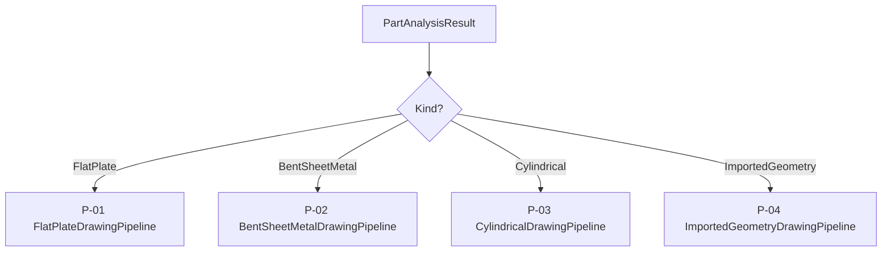

# Drawing pipelines overview

[← Documentation hub](../README.md)

Three pipelines implement the drawing automation strategy. Dispatch is in `SheetMetalDrawingService.ProcessDrawingModel` based on `PartAnalysisResult.Kind`.

---

## Comparison table

| ID | Enum | Class | Views | Fourth view | Primary SmartDim |
| --- | --- | --- | --- | --- | --- |
| **P-01** | `FlatPlate` | `FlatPlateDrawingPipeline` | Front, Top, Right | **Isometric** | Sub-kinds: Generic SmartDim, RoundDisc, RoundedEnd, ArcSector, Flange, Baffle |
| **P-02** | `BentSheetMetal` | `BentSheetMetalDrawingPipeline` | Front, Top, Right | **Flat pattern** | Modules A–G |
| **P-03** | `Cylindrical` | `CylindricalDrawingPipeline` | Front, Top, Right | **Isometric** | `Cylindrical/*` modules |
| **P-04** | `ImportedGeometry` | `ImportedGeometryDrawingPipeline` | Front, Top, Right | **Isometric** | `Imported/*` + SmartDim A,C,D |

---

## Shared pipeline steps

Every pipeline follows this skeleton:

```
1. DeleteExistingViews
2. CreateStandardThreeViews  → View1, View2, View3
3. Create fourth view        → isometric OR flat pattern
4. ApplyDimensions           → pipeline-specific
5. DrawingDimensionDeduper   → optional exclude View4 (isometric)
6. AutoArrangeDimensions
7. AdjustSheetScaleIfNeeded
8. ForceRebuild3(true)
```

Implementation details: [Shared drawing services](shared-drawing-services.md).

---

## Dispatch logic



Classification rules: [Part classification](part-classification.md).

---

## View4 naming nuance

Both **isometric** (P-01, P-03) and **flat pattern** (P-02) use the name **`Drawing View4`**.

Downstream code must know the pipeline context:

- Flat plate / cylindrical: skip View4 in dimension passes; deduper excludes isometric.
- Bent sheet metal: View4 **is** the flat pattern — fully dimensioned (module G).

Constant: `SmartDimConstants.IsometricViewName = "Drawing View4"`.

---

## Pipeline documents

| Pipeline | Detail doc |
| --- | --- |
| P-01 Flat plate | [pipeline-flat-plate.md](pipeline-flat-plate.md) |
| P-01 sub-kinds | [flat-plate-subkinds.md](flat-plate-subkinds.md) |
| P-01 ArcSector | [arc-sector-plate.md](../modules/arc-sector-plate.md) |
| P-02 Bent sheet metal | [pipeline-bent-sheet-metal.md](pipeline-bent-sheet-metal.md) |
| P-03 Cylindrical | [pipeline-cylindrical.md](pipeline-cylindrical.md) |
| P-04 Imported geometry | [pipeline-imported-geometry.md](pipeline-imported-geometry.md) |

---

## See also

- [Data flow](../architecture/data-flow.md)
- [Adding a pipeline](../development/adding-a-pipeline.md)
- [Dimension deduper](dimension-deduper.md)
