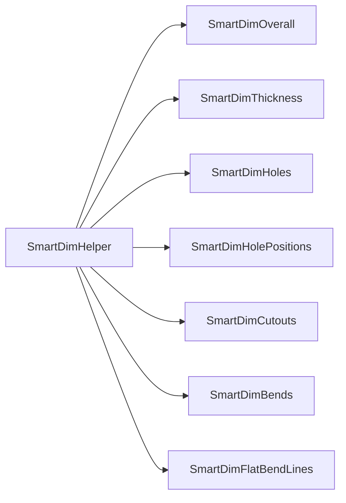

# SmartDim overview

[← Documentation hub](../README.md)

**SmartDim** is the automated dimensioning subsystem for sheet-metal flat and bent parts (pipelines P-01 and P-02). Cylindrical parts use separate modules under `Cylindrical/`.

---

## Architecture



| Layer | Location |
| --- | --- |
| Facade | `SmartDim/SmartDimHelper*.cs` (partial class) |
| Constants | `SmartDim/SmartDimConstants.cs` |
| Modules A–G | Project root `SmartDim*.cs` |

---

## Session state

Each pipeline creates one `SmartDimHelper` per drawing pass:

```csharp
SmartDimHelper dimHelper = new SmartDimHelper(swApp, model, drawing, modelDocExt);
dimHelper.SuppressDimInput();
try { /* modules */ }
finally { dimHelper.RestoreDimInput(); }
```

`DimensionedFeatures` — `HashSet<string>` of feature/entity keys already dimensioned in this session.

---

## View skipping rules

| View | Typical handling |
| --- | --- |
| View1–3 | Full module pass |
| View4 (isometric) | Skipped in P-01 / P-03 |
| View4 (flat pattern) | Module G only in P-02 |

---

## Diagnostics

Modules log via pipeline `Action<string> log` where wired; many also write to `Console.WriteLine` for developer debugging.

**Future improvement:** route all diagnostics through the UI log callback.

---

## See also

- [SmartDimHelper facade](helper-facade.md)
- [SmartDim modules A–G](modules.md)
- [Dimension deduper](../drawing/dimension-deduper.md)
