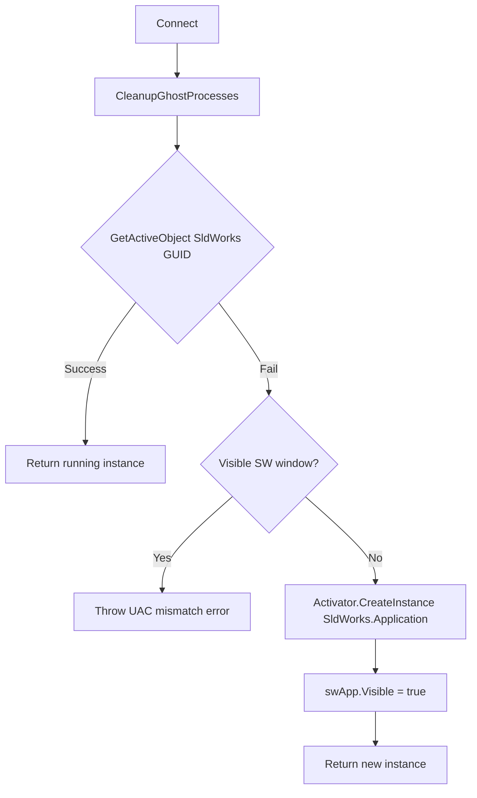

# COM connection to SOLIDWORKS

[← Documentation hub](../README.md)

## Overview

**Class:** `SolidWorksConnection`  
**File:** `Services/SolidWorksConnection.cs`  
**Return type:** `SolidWorksConnectionResult { ISldWorks App, bool IsNewInstance }`

The application connects to SOLIDWORKS through the Windows COM **Running Object Table (ROT)**. This is the standard pattern for out-of-process automation on Windows.

---

## Connection sequence



---

## COM identifiers

| Mechanism | Value |
| --- | --- |
| Class GUID | `96749377-3391-11D2-9EE3-00C04F797396` |
| ProgID | `SldWorks.Application` |
| P/Invoke | `oleaut32.dll!GetActiveObject` |

The GUID is used for `GetActiveObject`; ProgID is the fallback when starting a new instance.

---

## Ghost process cleanup

Before connecting, the helper scans processes named `SLDWORKS`:

- If **MainWindowTitle is empty** → treated as a background/ghost instance → `Kill()` + wait up to 3 s.
- Processes with a visible window are left running.

Ghost instances often appear after failed automation sessions and can block a clean ROT attach.

---

## UAC / privilege mismatch

If `GetActiveObject` fails **and** a visible SOLIDWORKS window exists, the code throws:

> SOLIDWORKS is running but connection failed. Run this app and SOLIDWORKS with the same privileges (both as admin or both as normal user).

**Cause:** ROT registration is per integrity level. A normal-user app cannot attach to an admin-launched SOLIDWORKS instance (and vice versa).

**Fix:** Launch both processes at the same privilege level.

---

## Bitness requirement

| Component | Architecture |
| --- | --- |
| SOLIDWORKS | x64 |
| This application | x64 (`PlatformTarget` in `.csproj`) |

A 32-bit process cannot reliably use the SOLIDWORKS COM API.

---

## Typical usage in the app

```csharp
var result = SolidWorksConnection.Connect(log);
ISldWorks swApp = result.App;
// ... batch processing ...
// Do not explicitly quit SW if IsNewInstance unless product policy requires it
```

The batch worker in `MainForm` calls `Connect` once per run.

---

## COM lifetime notes

| Topic | Guidance |
| --- | --- |
| **STA thread** | WinForms entry is `[STAThread]`; worker thread also runs COM calls — avoid parallel COM from multiple threads |
| **RCW release** | Prefer scoped use; do not hold stale `IModelDoc2` after `CloseDoc` |
| **Silent open** | Analysis uses `swOpenDocOptions_Silent` to suppress dialogs |
| **Document close** | Always close analysis parts in `finally`; drawings closed after save |

---

## Troubleshooting

| Symptom | Likely cause | Action |
| --- | --- | --- |
| COM type not registered | SOLIDWORKS not installed | Install/repair SOLIDWORKS |
| Connection failed + visible SW | UAC mismatch | Match admin/normal |
| Connection failed, no window | Ghost SLDWORKS | Restart SW or let cleanup kill ghosts |
| Wrong API behaviour | Interop version mismatch | Align NuGet interop with installed SW year |

Interop packages in this project: **32.1.0** (SOLIDWORKS 2024 API surface).

---

## See also

- [API reference by area](api-reference-by-area.md)
- [Getting started](../development/getting-started.md)
- [Data flow](../architecture/data-flow.md)
