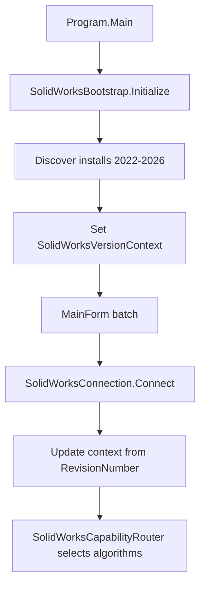

# SOLIDWORKS version router (2022–2026)

[← Documentation hub](../README.md)

## Purpose

The application must run on different SOLIDWORKS installations without rebuilding per machine.  
**SolidWorksBootstrap** + **SolidWorksCapabilityRouter** handle:

1. **Discovery** — find installed SOLIDWORKS 2022–2026
2. **Interop baseline** — NuGet `SolidWorks.Interop.* 32.1.0` bundled in published EXE
3. **Runtime strategy** — pick safe algorithms for the detected product year

---

## Startup flow

---

## Code map

| Type | File |
| --- | --- |
| Bootstrap | `Services/SolidWorks/SolidWorksBootstrap.cs` |
| Install discovery | `Services/SolidWorks/SolidWorksInstallDiscovery.cs` |
| Version context | `Services/SolidWorks/SolidWorksVersionContext.cs` |
| Capability router | `Services/SolidWorks/SolidWorksCapabilityRouter.cs` |

---

## Interop vs product year

| Layer | Source | Notes |
| --- | --- | --- |
| **Compile reference** | NuGet 32.1.0 | Always copied into publish output |
| **Installed interop file** | `{SW Install}\SolidWorks.Interop.sldworks.dll` | Used for discovery / optional AssemblyResolve |
| **Running API revision** | `ISldWorks.RevisionNumber()` | Refines year after connect |

Do **not** compile with `Private=false` local interop only — single-file EXE will fail with `FileNotFoundException` for version 33.5.x.

---

## Capability flags (summary)

| Feature | 2022–2026 |
| --- | --- |
| Hidden Lines Visible on all views | `DrawingViewDisplayHelper` after view creation |
| Cylindrical side-view centerline | Outer parallel edges + face pick (no silhouette API) |
| `AutoInsertCenterMarks2` | 2022–2024 only |
| Flat pattern palette search | Enabled |
| Silent document open | Enabled |

Details: [Version matrix](versions/version-matrix.md)

---

## Adding a version-specific rule

1. Add flag or enum value in `SolidWorksCapabilityRouter.cs`
2. Gate code with the flag (never hard-code year in pipelines)
3. Document in [version-matrix.md](versions/version-matrix.md)
4. Log strategy in connection (`GetStrategyNotes()`)

---

## See also

- [COM connection](com-connection.md)
- [Version matrix 2022–2026](versions/version-matrix.md)
- [Cylindrical module](../modules/cylindrical-annotations.md)
